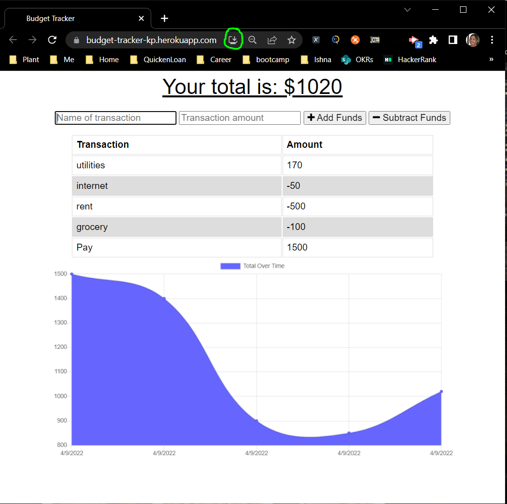

# Budget Tracker

## Table of Contents

- [Overview](#overview)
- [Deployment](#deployment)
- [Details](#details)
- [Technologies Used](#technologies-used)
- [Contributor](#contributor)

## Overview

Giving users a fast and easy way to track their money and allowing them to access that information at any time is even more important. Having offline functionality is paramount to the success of an application that handles users’ financial information.

The user will be able to add expenses and deposits to their budget with or without a connection. If the user enters transactions offline, the total should be updated when they're brought back online.

## Deployment

Application Deployed to Heroku. Please refer below link to access site:

https://budget-tracker-kp.herokuapp.com/

The following image shows the web application's appearance and functionality:

This is progressive web application and you can install either using your smart phone or desktop app. Follow these instructions to install a PWA for your specific smartphone OS:

`iOs:`

- Navigate to https://budget-tracker-kp.herokuapp.com/ with Safari.
- Tap the Share button in Safari.
- Tap the icon labeled Add to Home Screen.
- Name your PWA, then tap Add in the upper-right corner.
- Check your Home Screen to see the app.

`Android:`

- Navigate to https://budget-tracker-kp.herokuapp.com/ with Chrome.
- Tap the menu button in the upper right corner of Chrome.
- Tap the icon labeled Add to Home Screen.
- Name your PWA, then tap Add below the prompt.
- If there is an additional prompt asking "Add to Home screen?", tap Add.
- Check your Home Screen to see the app.

If you currently do not have access to a smart phone, do the following on your computer:

- Navigate to https://budget-tracker-kp.herokuapp.com/ with Chrome.
- Open the Settings in Chrome.
- Click on Install Images App...
- At the prompt "Install app?", click Install.
- A new Chrome window opens with our application running in it. It is now installed as a desktop app!

## Details

### User Story

    AS AN avid traveler
    I WANT to be able to track my withdrawals and deposits with or without a data/internet connection
    SO THAT my account balance is accurate when I am traveling

### Acceptance Criteria

    GIVEN a budget tracker without an internet connection
    WHEN the user inputs an expense or deposit
    THEN they will receive a notification that they have added an expense or deposit
    WHEN the user reestablishes an internet connection
    THEN the deposits or expenses added while they were offline are added to their transaction history and their totals are updated

## Technologies Used

- Web Application Framework - ExpressJS
- Database - MongoDB
- ODM - Mongoose
- Offline functionality - IndexedDB
- PWA - Service Worker
- Deployment - Heroku

## Contributor

